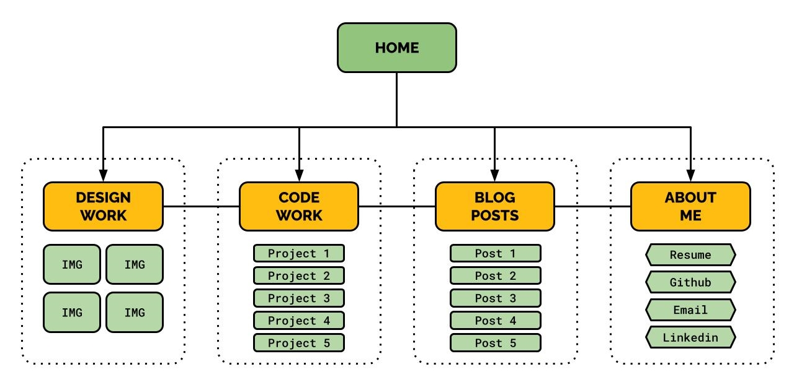

# Sanjeev Prasad T1A2 - Website Portfolio

**Published Portfolio URL:** https://sanjeevprasad-t1a2.netlify.app/

**GitHub Repo:** https://github.com/SanjeevCA/SanjeevPrasad_T1A2/

## Purpose
The purpose of the website...

## Target Audience

## Sitemap

## Functionality / Features
Some of the features developed for the site...

## Screenshots

## Components List
* Page Header
* Navigation Bar
* Footer
* Content Container
* Homepage Cards
* Collage Display
* Blog Posts
* Skills Tags
* Social Links

## Tech Stack

